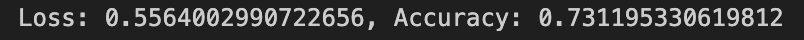

**1. Overview:** A nonprofit foundation seeks a model to evaluate applicant funding requests. This model uses a binary classifier to predict successful funding. Three models were made and this report is analyzing model number 4. 

**2. Results:** 
- **Data Preprocessing:**
    - **Target Variables of the Model:** The target variable is IS_SUCCESSFUL. This is how we'll test the model's predictive powers.  
    - **Feature Variables of the Model:** The feature variables are APPLICATION_TYPE, AFFILIATION	CLASSIFICATION, USE_CASE, ORGANIZATION, STATUS, INCOME_AMT, SPECIAL_CONSIDERATIONS, and ASK_AMT. All of these variables seem to have an impact, even if small, on the model's performance.  
    - **Removed Variables:** The removed variables are EIN and NAME. These are unique categorical data that will not help the model make determinations.  
- **Compiling, Training, and Evaluating the Model:**
    - **Number of neurons, layers, and activation functions:** Model 4 contains three hidden layers, the first two using Relu and the last using Sigmoid activation functions. The first hidden layer has 4 neurons, the second has 3, and the final hidden layer has 2 neurons. 
    - **Model Performance Target:** Model 4 surpassed the target of 75% accuracy, acheiving about 79% accuracy.
    - **Enhancing the Model:** Model 4 uses both Relu and Sigmoid. It has about the same accuracy is Model 3 but with lower Loss. Model 4 improves upon Model 1 by using fewer neurons. In addition to the change in activation functions, I also experimented with dropping more columns, creating more bins, changing the number per bin, and changing the hidden layers and numbers of neurons. Model 5 explores using K-means clustering and PCA to reduce the fields but this did not yield better results. There are many combinations and further experimentation would likely yield a higher performing model. 

**3. Summary:** The overall results are 79% accuracte. It's a good start but more can be done. A different approach to creating the bins might yeild better results. 

 
*Model 4 Performance*
